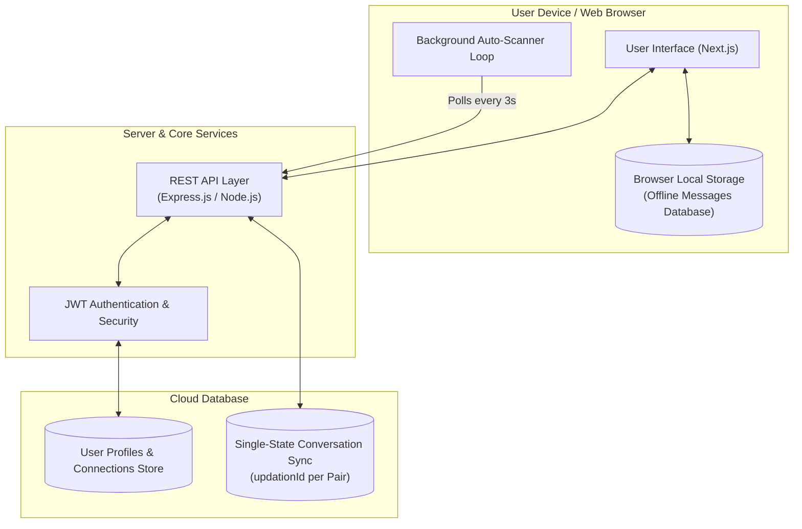
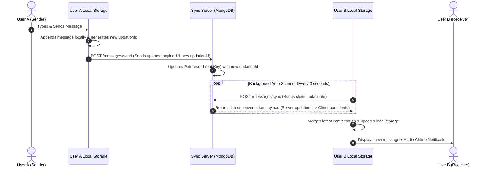
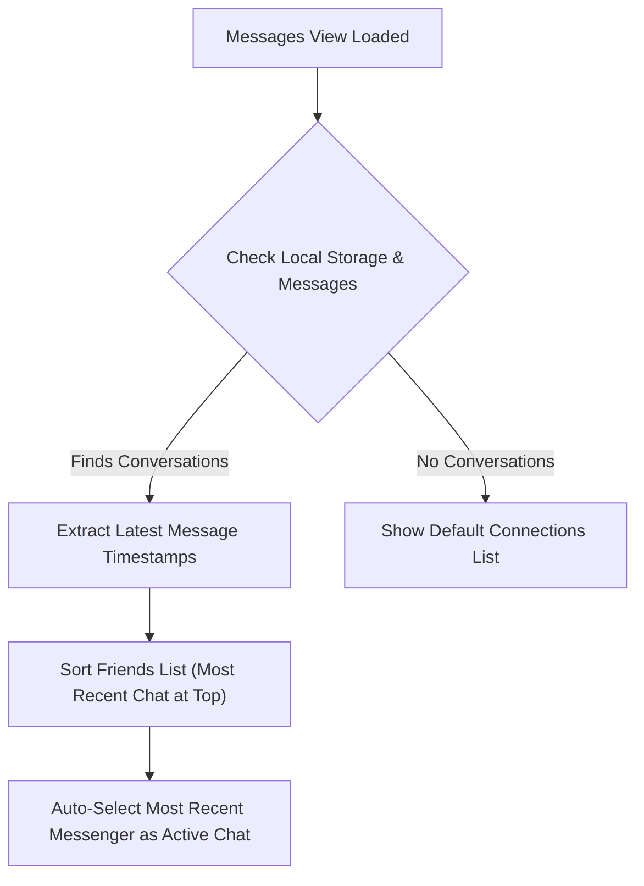

# System Architecture & Complete Workflow Documentation

This document provides a comprehensive non-technical overview of the entire system, its architectural flow, data lifecycles, and sub-system behaviors.

---

---

## 1. Executive Summary & Core Philosophy

The application is built on an **Offline-First, Pair-State Synchronization Model**. 

### Key Principles:
1. **Local Ownership**: All chat history resides locally inside the user's browser device. No individual message records are stored as millions of separate database entries on the server.
2. **Single-State Server Sync**: The central server maintains a single synchronized record per conversation pair (User A + User B) identified by a unique `pairKey` and a monotonically increasing `updationId`.
3. **Seamless Multi-Device Experience**: Whenever a user comes online or sends a message, their device compares its local `updationId` with the server's `updationId`. The device or server with the newer timestamp updates the counterpart, ensuring both users always view the identical, latest conversation state.

---

## 2. End-to-End System Workflow

### Step 1: User Onboarding & Authentication
1. **Registration & Profiles**:
   - New users create accounts with a unique username, standard credentials, and optional profile metadata (profile pictures, bio, tags, skills).
   - Upon successful login, the server issues a secure JSON Web Token (JWT) saved in browser storage to authenticate all subsequent actions.

2. **Connection & Social Discovery**:
   - Users can search for other connections across the network.
   - Adding a user updates both accounts' connection lists, allowing direct peer-to-peer messaging.

---

### Step 2: Messaging Lifecycle & Real-Time Sync

#### Detailed Breakdown:

1. **Sending a Message**:
   - When **User A** types a message to **User B**, the message is immediately saved to **User A's local device database**.
   - A unique timestamp/updation key is generated.
   - User A's device notifies the server by updating the pair's shared record with the latest full chat state and new `updationId`.

2. **Background Auto-Scanning & Polling**:
   - While the app is active, a silent background scanner loop runs periodically (every 3 seconds).
   - It checks the pair's current `updationId` on the server against the local device key.

3. **Sync Resolution & Receiving Messages**:
   - When **User B** comes online or the background scanner triggers:
     - **If Server `updationId` > Local `updationId`**: User B's device downloads the updated conversation payload, saves it locally, plays an audio chime, and displays a toast notification.
     - **If Client `updationId` > Server `updationId`**: The server updates its record to match the device.
     - **If both match**: No data transfer is required, saving bandwidth.

---

## 3. UI/UX & Dynamic Presentation

### 1. Dynamic Conversation Sorting
- The connections sidebar dynamically sorts all friends based on the timestamp of their most recent message (`timeB - timeA`).
- The contact with the latest activity automatically bubbles up to the very top of the list, displaying a snippet preview (`You: ...` or incoming text) and time tag.

### 2. Intelligent Default Selection
- When opening or refreshing the Messages page, the system automatically inspects local message history and opens the chat thread of the **most recent messenger**.
- If a user clicks "Message" directly from another user's profile page, the app respects the parameter and opens that specific conversation.

### 3. Isolated Dual-Pane Scroll Containment
- The interface features strict vertical scroll isolation:
  - **Sidebar Scroll**: Scrolling through long connection lists moves only the sidebar without scrolling the whole page.
  - **Thread Scroll**: Scrolling through long chat histories stays contained inside the message window.

---

## 4. Security & Data Integrity

1. **Pair Key Privacy**:
   - Each conversation pair has a unique, deterministically generated pair identifier based on alphabetically sorted usernames (`userA__userB`).
   - Only authenticated users belonging to `userA` or `userB` are authorized to query or update that conversation state.

2. **Token Security**:
   - Requests are verified against JWT signatures. Unauthorized attempts to read or mutate chat payloads are rejected at the server gateway.

3. **Reliable Conflict Resolution**:
   - The numerical monotonicity of `updationId` guarantees that network delays or out-of-order requests never overwrite newer conversations with stale data.

---

## 5. Summary Matrix of System Components

| Component | Responsibility | Storage / Location |
| :--- | :--- | :--- |
| **Frontend App** | UI layout, state management, audio notifications, sorting | User's Browser (Next.js) |
| **Local Storage Database** | Permanent offline chat log persistence per contact | Browser LocalStorage |
| **REST Server API** | Authentication gateway, pair verification, sync dispatch | Node.js / Express Backend |
| **Database Sync Store** | Single-record per conversation pair storing `updationId` & latest snapshot | MongoDB Cloud |
| **Background Auto-Scanner** | Periodic synchronization and instant notification triggering | Browser Event Loop |
